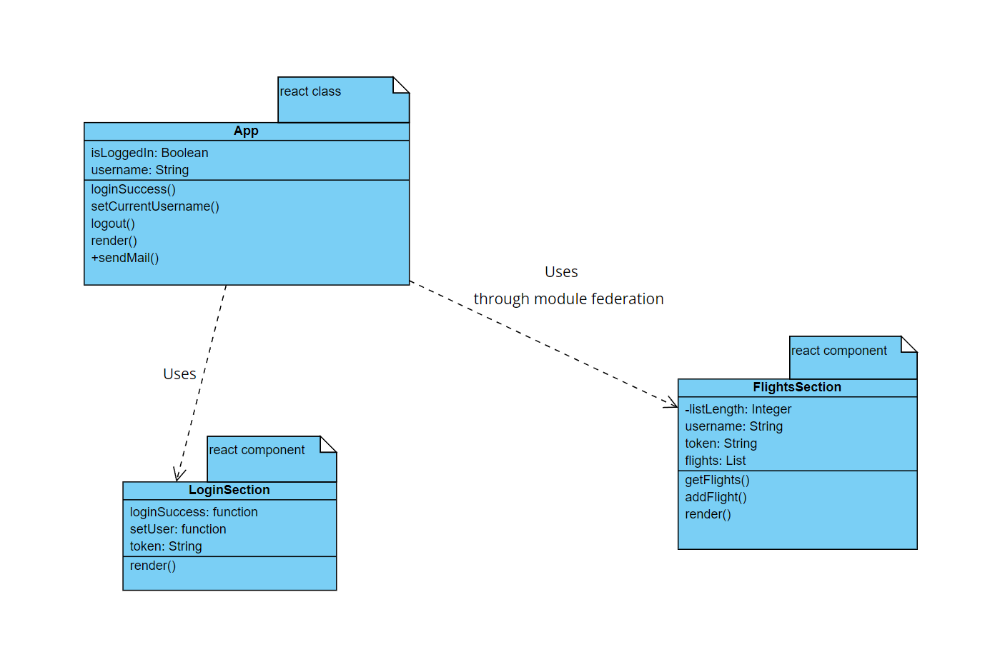

# SOA-project
Application using micro frontends and microservices through secured API calls.

run **docker build -t image-name .** for each project

run **docker-compose up** to create the containers and start thhe application.

## Diagrams

c4 context diagram

c4 container diagram

UML diagram of the fromtend components

## Web server

The web server is a Node.js application that has 3 parts.
One **microservice** is the **user service** that holds the users information and exposes a secured REST API to perform the authentication.

Another **microservice** is the **flights service** that holds the flights information and exposes a secured REST API to add a new flight and retrieve the information for the users.

The third component is the **API Gateway** that exposes a secured REST API which is used by the frontend applications. The gateway validates informaion and sends requests to the two microservices in order to perform the needed actions.

The securization is done through **Auth0**.

## Web app

The web app uses **microfrontend architecture** and consists of a **main app** that has the login component and the logout and send mail component, and a **secondary app** that has the flight component which allows the user to add or see the flights. The module in the secondary app is exposed by **webpack module federation** and imported and integrated in the main app.

The app is receiving server side notifications through the **socket.io** library.

## Integration

The API Gateway sends API calls to  **SendGrid** (a 3rd party email service). There is a section in the frontend where the user can put an email address and a name and with the press of a button, a request is sent to the API Gateway that triggers the send of another API request to SendGrid which sends the mail to the email address.

SendGrid can show information about the mails that have been sent

## Containers

All the projects that form the application have config files for building the **Docker** images and **docker-compose** is used to create and start all the containers in the right order in the same internal network.

docker images

docker containers running

